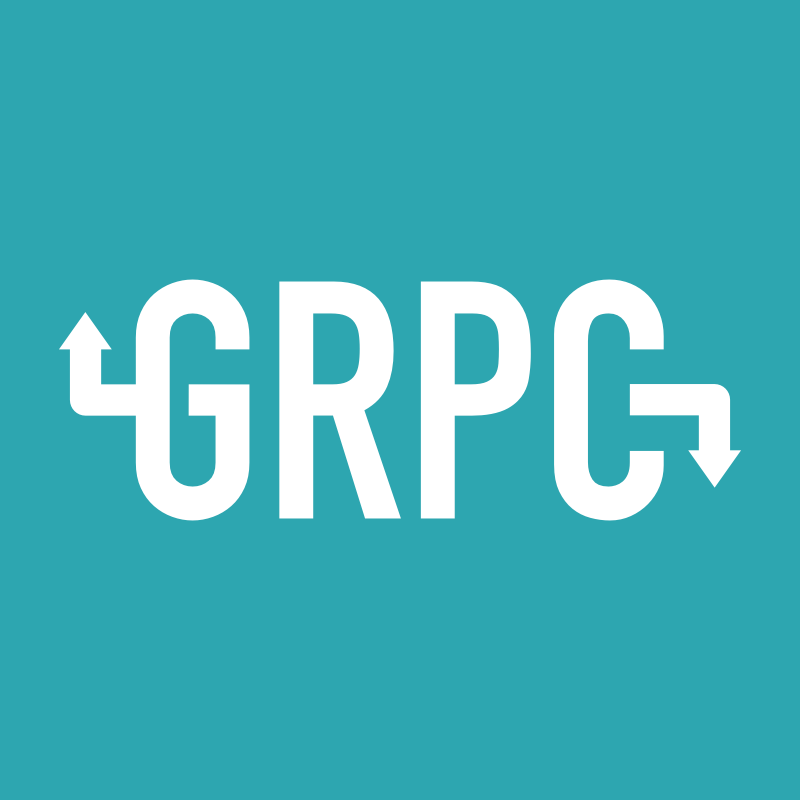
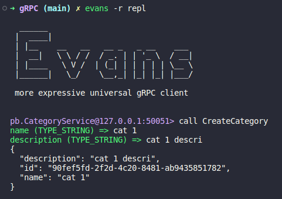

<div align="center">
    
</div>

---

A modern open-source **RPC framework** which delivers high performance and efficiency in any environment. It supports both typical request/response interactions and long-running **streaming communications**.

**table of contents:**

> <details>
>
> <summary>Types of gRPC</summary>
>
>* [Unary](#Unary)
>* [Server streaming](#Server-streaming)
>* [Client streaming](#Client-streaming)
>* [Bidirectional streaming](#Bidirectional-streaming)
>
> </details>
>
> <details>
>
> <summary>Proto Buffers</summary>
>
>* [Overview](#Overview)
>* [Syntax](#Syntax)
>
> </details>
>
> <details>
>
> <summary>Evans</summary>
>
>* [REPL mode](#REPL)
>* [CLI mode](#CLI)
>
> </details>
>
> <details>
>
> <summary>Hands-On</summary>
>
>* [Category Project](#Category-Project)
>   * [Install](#Install)
>   * [Init](#Init)
>   * [Database](#Database)
>   * [Run](#Run)
>   * [Info](#Info)


This article will show you how to create a gRPC server in Go.

After reading this article, you will be able to:

* Understand what gRPC is and how it works
* Undesrtand protobuf and how it works
* Create a gRPC server
* Use Evans to make calls and test the gRPC server

---

# Types of gRPC

gRPC supports four types of RPCs:

* <h3 id="Unary">Unary</h3>

    A single request and a single response. The most common type of RPC.

* <h3 id="Server-streaming">Server streaming: </h3>

    A single request and a stream of responses. The server sends a stream of responses to the client.

* <h3 id="Client-streaming">Client streaming</h3>

    A stream of requests and a single response. The client sends a stream of requests to the server.

* <h3 id="Bidirectional-streaming">Bidirectional streaming</h3>

    A stream of requests and a stream of responses. The client and server send a stream of messages to each other.

## Protocol buffers

Protocol Buffers are a language-neutral, platform-neutral extensible mechanism for serializing structured data.

* <h3 id="Overview">Overview</h3>

    gRPC uses [Protocol Buffers](https://developers.google.com/protocol-buffers) (Protobuf) as the Interface Definition Language (IDL) for describing both the service interface and the structure of the payload messages. The IDL is used to generate the gRPC client and server interfaces in your chosen language.

* <h3 id="syntax">Syntax</h3>

    The syntax for defining a service in a `.proto` file is as follows:

```proto
// Define the syntax of the proto file
syntax = "proto3";

// Define the package name
package example;

// Create a message
message HelloRequest {
  string name = 1;
}
message HelloResponse {
  string message = 1;
}

// Create list of messages
message HelloRequestList {
  repeated HelloRequest requests = 1;
}
message HelloResponseList {
  repeated HelloResponse responses = 1;
}

// Define the service
service HelloService {
  // Define the rpc method and the request/response types

  // Unary
  rpc Hello (HelloRequest) returns (HelloResponse) {}
  
  // Client streaming
  rpc ClientStreamHello (stream HelloRequest) returns (HelloResponseList) {}

  // Server streaming
  rpc ServerStreamHello (HelloResponseList) returns (stream HelloResponse) {}

  // Bidirectional streaming
  rpc BidirectionalStreamHello (stream HelloRequest) returns (stream HelloResponse) {}
}
```

## Evans

Evans is a gRPC client for humans works via command line. It has two use modes: REPl and CLI. This repository example uses REPL mode.

* <h3 id="REPL">REPL</h3>

    You can use it without thinking like the package name, service name, RPC name, command usage, and so on because REPL mode has powerful completion!

* <h3 id="CLI">CLI</h3>

    CLI mode is a stateless mode just like [polyglot](https://github.com/grpc-ecosystem/polyglot). It sends one request per one command as its name suggests. So it is based on UNIX philosophy.

## Hands-On

In this repository is a project that implements a gRPC server in Go. The OS used is linux Mint, but it should work on any linux distribution, mac or wsl.

<h3 id="Category-Project">Category Project</h3>

This project uses gRPC, here is the [proto file](/proto/category.proto). We will create the go files from the proto file, implement it's interface and test it with Evans. The project uses a sqlite3 database to store the data.
It is assumed that you have go installed and configured, and have a basic understanding of go modules.

Before we start, **checkout the [Info](#Info) section**.

To run and test the project, follow the steps below:

<h3 id="Install">Install</h3>

```bash
# install protobuffers and gRPC packages
go install google.golang.org/protobuf/cmd/protoc-gen-go@v1.28
go install google.golang.org/grpc/cmd/protoc-gen-go-grpc@v1.2

# install protoc compiler
apt install -y protobuf-compiler

# Install sqlite3
apt install sqlite3

# install Evans 
go get github.com/ktr0731/evans
```

<h3 id="Init">Init</h3>

```bash
# initiate go module
go mod init github.com/vinisbitten/learning-gRPC

# create proto file
# go_out is used to generate the protobuf service interface
# go-grpc_out is used to generate the gRPC service interface
protoc --go_out=. --go-grpc_out=. proto/category.proto

# tidy up
go mod tidy
```

<h3 id="Database">Database</h3>

```bash
# create database
sqlite3 db.sqlite

# create table
create table categories (id string, name string, description string);
```

<h3 id="Run">Run</h3>

```bash
# run the server
go run main.go

# in a new terminal --> run Evans REPL
evans -r repl

# from here make the calls and watch the results
call [service name]
```

<div align="center">
    
</div>

<h3 id="info">Info</h3>

* **YOU WILL HAVE TO READ THE CODE TO UNDERSTAND THE PROJECT**
* The category proto service is implemented [here](/internal/server/category.go).
* The proto files have to be generated in folder ```/internal/pb```, so the project can find them.
* We assure this in the proto file with the option ```option go_package = "internal/pb"```.
* The commands should be run from the root path of the project.
* The database file is created in the root path of the project.
